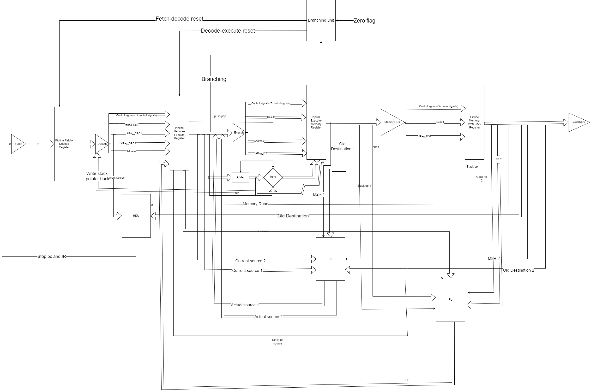
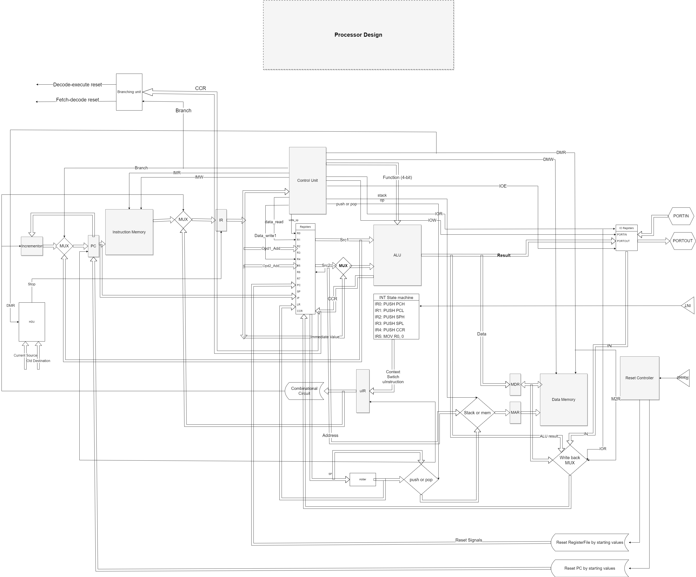

<h1> MIPS-Microprocessor-Design </h1>

 A RISC-like, five-stages pipeline processor implemented using Verilog

## 📝 Table of Contents

- [About](#About)
- [Built With](#Built-With)
- [Design](#Design)
- [ISA](#ISA)
- [Input signals](#Input-signals)
- [Contributors](#Contributors)
- [License](#License)

# 📑 About

A RISC-like, five-stages pipeline processor implemented using Verilog ,It is based on the Reduced Instruction Set Computer (RISC) architecture, The five stages of the pipeline include instruction fetch, instruction decode, execution, memory access and write back. Each stage takes a single clock cycle to complete and the instructions are executed in parallel. This allows for faster execution of instructions compared to other architectures. Verilog is used to implement the processor.

## ⛏️Built with

- Verilog

## Design

### Non Pipelined

### Pipelined

## ISA

| Category          | Instruction | Opcode (Category) | Opcode (Number) | Source | Destination | Immediate value |
| ----------------- | ----------- | ----------------- | --------------- | ------ | ----------- | --------------- |
| Zero operand      | NOP         | 000               | 000000          | UUU    | UUUU        | U               |
| Zero operand      | SETC        | 000               | 000001          | UUU    | UUUU        | U               |
| Zero operand      | CLRC        | 000               | 000010          | UUU    | UUUU        | U               |
| ----------------- | ----------- | ----------------- | --------------- | ------ | ----------- | --------------- |
| One operand       | NOT         | 001               | 000000          | DDD    | DDDD        | U               |
| One operand       | INC         | 001               | 000001          | DDD    | DDDD        | U               |
| One operand       | DEC         | 001               | 000010          | DDD    | DDDD        | U               |
| One operand       | OUT         | 001               | 000011          | UUU    | DDDD        | U               |
| One operand       | IN          | 001               | 000100          | UUU    | DDDD        | U               |
| ----------------- | ----------- | ----------------- | --------------- | ------ | ----------- | --------------- |
| TWO operand       | MOV         | 010               | 000000          | DDD    | DDDD        | U               |
| TWO operand       | ADD         | 010               | 000001          | DDD    | DDDD        | U               |
| TWO operand       | SUB         | 010               | 000010          | DDD    | DDDD        | U               |
| TWO operand       | AND         | 010               | 000011          | DDD    | DDDD        | U               |
| TWO operand       | OR          | 010               | 000100          | DDD    | DDDD        | U               |
| TWO operand       | SHL         | 010               | 000101          | DDD    | DDDD        | U               |
| TWO operand       | SHR         | 010               | 000110          | DDD    | DDDD        | U               |
| TWO operand       | SHLI        | 010               | 000111          | DDD    | DDDD        | D               |
| TWO operand       | SHRI        | 010               | 001000          | DDD    | DDDD        | D               |
| TWO operand       | MOVI        | 010               | 001001          | DDD    | DDDD        | D               |
| TWO operand       | ADDI        | 010               | 001010          | DDD    | DDDD        | D               |
| TWO operand       | SUBI        | 010               | 001011          | DDD    | DDDD        | D               |
| TWO operand       | ANDI        | 010               | 001100          | DDD    | DDDD        | D               |
| TWO operand       | ORI         | 010               | 001101          | DDD    | DDDD        | D               |
| ----------------- | ----------- | ----------------- | --------------- | ------ | ----------- | --------------- |
| MEMORY operation  | PUSH        | 011               | 000000          | UUU    | DDDD        | U               |
| MEMORY operation  | POP         | 011               | 000001          | UUU    | DDDD        | U               |
| MEMORY operation  | LDM         | 011               | 000010          | UUU    | DDDD        | D               |
| MEMORY operation  | LDD         | 011               | 000011          | DDD    | DDDD        | U               |
| MEMORY operation  | STD         | 011               | 000100          | DDD    | DDDD        | U               |
| ----------------- | ----------- | ----------------- | --------------- | ------ | ----------- | --------------- |
| Control operation | JZ          | 100               | 000000          | UUU    | DDDD        | U               |
| Control operation | JN          | 100               | 000001          | UUU    | DDDD        | U               |
| Control operation | JC          | 100               | 000010          | UUU    | DDDD        | D               |
| Control operation | JMP         | 100               | 000100          | DDD    | DDDD        | U               |
| Control operation | CALL        | 100               | 000110          | DDD    | DDDD        | U               |
| Control operation | RET         | 100               | 001000          | UUU    | DDDD        | U               |
| Control operation | RTI         | 100               | 001010          | UUU    | DDDD        | U               |
| ----------------- | ----------- | ----------------- | --------------- | ------ | ----------- | --------------- |

## Input signals

| Signal    |
| --------- |
| Interrupt |
| reset     |

## Contributors

<table>
  <tr>

<td align="center">
<a href="https://github.com/Abd-ELrahmanHamza" target="_black">
 <b>Abdelrahman Hamza</b></a> 
</td>

<td align="center">
<a href="https://github.com/ahmedmadbouly186" target="_black">
 <b>Ahmed Madbouly</b></a> 
</td>

<td align="center">
<a href="https://github.com/Ahmedsabry11" target="_black">
 <b>Ahmed Sabry</b></a> 
</td>

<td align="center">
<a href="https://github.com/AhmedAlaa2024" target="_black">
 <b>Ahmed Alaa</b></a> 
</td>

</tr>
 </table>

## License 

> This software is licensed under MIT License, See [License](https://github.com/CMP24-SWE-TEAM3/Front-End/blob/main/LICENSE) .
